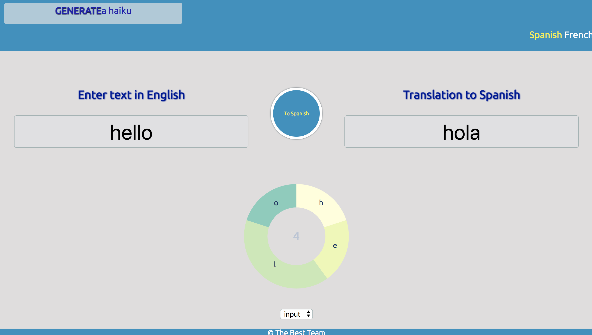

# Natural Language Translation Project

## This project has the following goals:

- Create a Machine Translation System application, based on the Recurrent Neural Network with Keras deep learning model.
- Implement a haiku generator using character-level multi-layer Recurrent Neural Network model.
- Deploy the application.

## Results:

- Language Model was trained on 100 000 pairs for each language (English - Spanish and English - French) and is able to translate short phrases like 'where is the bathroom', 'give me a fork', 'I like to swim' etc.
- Haiku Model generates haiku, that sound close to the haiku rules
- Application was deployed

## Steps of project:

1. Data acquisition, cleaning and preparation of dataset.
2. Building model with Keras.
3. Model training (Test-Train).
4. Developing Flask app.
5. Developing Front-end.
6. Deploying.

## Local use:

- Install all necessary libraries.
- Proceed to local_app --> app folder.
- Run app.py
- Open localhost http://127.0.0.1:5000/

## Team Members:

- Christina Park
- Malvika Mathur
- Ed Ali
- Sonya Smirnova
- Abubeker Ali

## Tools Used:

- Python
- Tensor Flow
- Keras
- Pandas
- BeautifulSoup
- MongoDB
- Selenium
- Flask
- JavaScript
- HTML

## Output of the project

